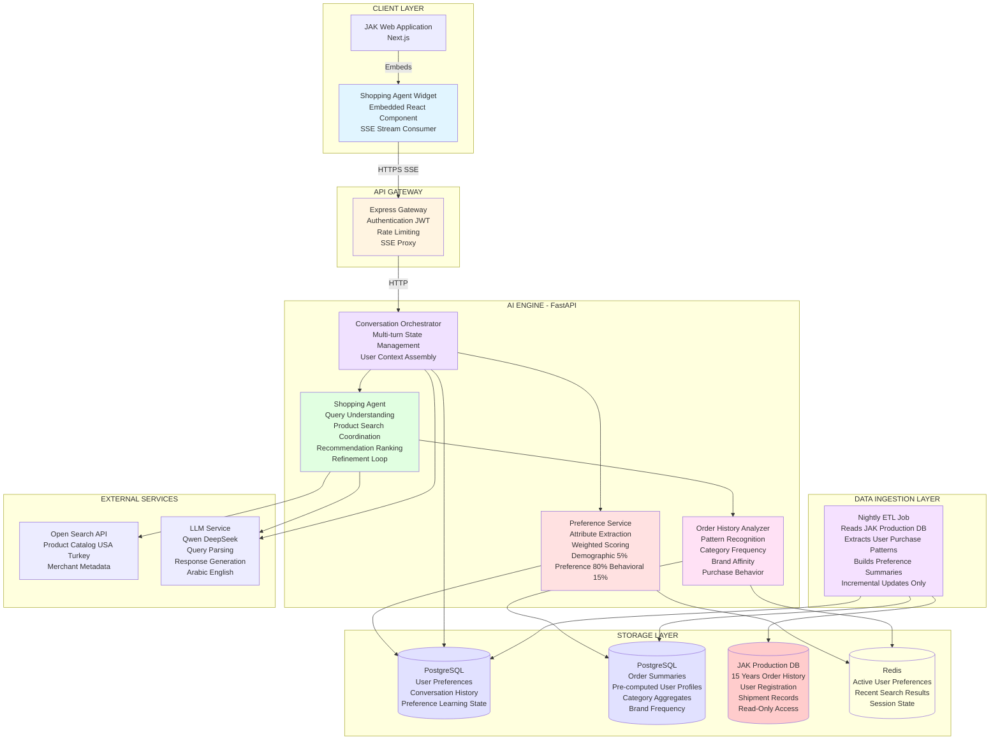

# JAK Delivery AI Shopping Agent - Production System Architecture



## Data Flow Architecture

### 1. Historical Data Ingestion (Nightly ETL)

**Purpose:** Transform 15 years of operational data into actionable preference summaries

**Process:**
```
JAK Production DB (5 Years History)
    │
    ├─ Orders Table (Partitioned by Year)
    ├─ Shipments Table
    ├─ User Registration
    │
    ▼
[ETL Pipeline - Nightly 2AM]
    │
    ├─ Incremental Read (Last 24h Changes)
    ├─ User-Level Aggregation
    │   ├─ Category Frequency (Electronics: 45%, Fashion: 30%, Home: 25%)
    │   ├─ Brand Affinity (Nike: 12 orders, Adidas: 8 orders)
    │   ├─ Origin Preference (USA: 70%, Turkey: 30%)
    │   ├─ Purchase Frequency (Monthly, Quarterly, Yearly)
    │   └─ Average Order Value
    │
    ▼
[Summary Database - PostgreSQL]
    │
    ├─ user_preference_summary
    │   ├─ user_id
    │   ├─ top_categories JSON
    │   ├─ top_brands JSON
    │   ├─ preferred_origins JSON
    │   ├─ purchase_frequency
    │   ├─ avg_order_value
    │   └─ last_updated
    │
    └─ user_order_aggregates
        ├─ user_id
        ├─ total_orders
        ├─ category_distribution JSON
        └─ brand_distribution JSON
```

**Why This Design:**
- JAK Production DB has 5 years of data - cannot query in real-time
- ETL pre-computes summaries for instant access during conversations
- Incremental updates keep data fresh without full scans
- Read-only access to production DB protects operational systems

### 2. Real-Time Preference Management

**User Preference Storage (PostgreSQL):**
```sql
-- Stores explicit preferences from conversations
CREATE TABLE user_preferences (
    user_id VARCHAR PRIMARY KEY,
    demographic JSONB,  -- age, gender, preferred_origins
    preferences JSONB,  -- colors, sizes, brands, styles, budget
    behavioral JSONB,   -- interaction_history, refinement_patterns
    learning_score FLOAT,
    created_at TIMESTAMP,
    updated_at TIMESTAMP
);

-- Stores conversation context
CREATE TABLE conversation_history (
    conversation_id UUID PRIMARY KEY,
    user_id VARCHAR,
    messages JSONB[],
    intent VARCHAR,
    products_shown JSONB[],
    created_at TIMESTAMP
);
```

**Why PostgreSQL:**
- Structured preference data with JSONB flexibility
- ACID transactions for preference updates
- Efficient indexing on user_id for fast lookups
- No need for separate vector DB - preferences are structured attributes, not embeddings

### 3. Preference Engine Logic

**Attribute Weighting:**
```
User Query: "I need Nike shoes"
    │
    ▼
[Preference Service]
    │
    ├─ Load from Cache (Redis)
    │   └─ Cache Miss → Load from PostgreSQL
    │
    ├─ Demographic Attributes (5% weight)
    │   ├─ Age: 25-35 (inferred from order history)
    │   └─ Preferred Origin: USA (70% of past orders)
    │
    ├─ Preference Attributes (80% weight)
    │   ├─ Explicit: "Nike" brand (from query)
    │   ├─ Implicit: Size 42 (from order history)
    │   ├─ Implicit: Black/White colors (frequent in past orders)
    │   └─ Budget: $50-$100 (avg order value)
    │
    └─ Behavioral Attributes (15% weight)
        ├─ Purchase Frequency: Monthly
        ├─ Category: Shoes (30% of past orders)
        └─ Interaction: Prefers sporty styles (refinement history)
    │
    ▼
[Weighted Preference Vector]
    {
        "brand": "Nike" (explicit, weight: 1.0),
        "size": "42" (implicit, weight: 0.8),
        "colors": ["black", "white"] (implicit, weight: 0.6),
        "budget": {"min": 50, "max": 100} (implicit, weight: 0.7),
        "origin": "USA" (implicit, weight: 0.9),
        "category": "shoes" (explicit, weight: 1.0)
    }
```

**Why No Vector Database:**
- Preferences are structured attributes (brand, size, color), not semantic embeddings
- Matching is rule-based with weighted scoring, not similarity search
- PostgreSQL JSONB queries handle attribute matching efficiently
- Vector DB would add complexity without benefit for this use case

### 4. Product Search and Recommendation Flow

```
[Shopping Agent]
    │
    ├─ Receive User Query: "I need Nike shoes"
    │
    ├─ Load User Context
    │   ├─ Preference Service → Get weighted preferences
    │   └─ History Analyzer → Get order summaries
    │
    ├─ Build Search Query
    │   └─ Combine: explicit query + implicit preferences
    │       → "Nike shoes size 42 black white USA origin budget 50-100"
    │
    ├─ Call Internal Data Source
    │   ├─ Filter: origin=USA
    │   ├─ Filter: brand=Nike
    │   ├─ Filter: category=shoes
    │   └─ Return: 20 products
    │
    ├─ Rank Products (Rule-Based Scoring)
    │   ├─ Exact brand match: +40 points
    │   ├─ Size match: +30 points
    │   ├─ Color match: +20 points
    │   ├─ Budget match: +10 points
    │   └─ Sort by total score
    │
    ├─ Generate Match Scores
    │   ├─ Product 1: 100 points → 100% match
    │   ├─ Product 2: 90 points → 90% match
    │   └─ Product 3: 75 points → 75% match
    │
    └─ Format Response (LLM)
        └─ "Here are 3 Nike shoes matching your preferences..."
```

**Why No ML Recommendation System:**
- Phase 1 scope: preference-based recommendations, not collaborative filtering
- Rule-based scoring is transparent and explainable (BRD Section 9 - Transparency)
- 15 years of history used for preference extraction, not model training
- ML models add complexity and latency without clear Phase 1 benefit
- Can add ML in Phase 2 if needed based on user feedback

### 5. Conversation State Management

**Why LangGraph:**
- Multi-turn conversations require state persistence across messages
- User journey has distinct stages: context assembly → preference gathering → search → refinement
- State machine handles three user types: logged-in with history, logged-in without history, new user
- Orchestrates multiple services: preference service, history analyzer, shopping agent, LLM

**State Flow:**
```
[User Message] → [Orchestrator]
    │
    ├─ State: NEW_USER
    │   └─ Action: Gather preferences via questions
    │
    ├─ State: EXISTING_USER_NO_HISTORY
    │   └─ Action: Gather preferences + explain JAK
    │
    ├─ State: EXISTING_USER_WITH_HISTORY
    │   ├─ Load order summaries
    │   ├─ Load preferences
    │   └─ Action: Direct to product search
    │
    ├─ State: SEARCHING
    │   └─ Action: Call Open Search + rank products
    │
    ├─ State: REFINING
    │   └─ Action: Update preferences + re-search
    │
    └─ State: COMPLETE
        └─ Action: Provide shopping links
```

### 6. Scalability Design

**User Scale Assumptions:**
- Phase 1: 1,000-5,000 active users
- 15 years of historical data: ~500,000 users, ~5M orders

**Performance Optimizations:**

**Caching Strategy (Redis):**
```
Active User Preferences (TTL: 1 hour)
    └─ Reduces PostgreSQL load for frequent queries

Recent Search Results (TTL: 15 minutes)
    └─ Avoids redundant Open Search API calls

Session State (TTL: 30 minutes)
    └─ Conversation context for multi-turn chats
```

**Database Optimization:**
```
Summary Database:
    ├─ Indexes: user_id, last_updated
    ├─ Partitioning: Not needed for Phase 1 scale
    └─ Connection Pooling: 20 connections

JAK Production DB:
    ├─ Read-Only Access
    ├─ ETL uses bulk reads (not row-by-row)
    └─ No impact on operational systems
```

**API Rate Limiting:**
```
Per-User: 100 requests/hour
Per-IP: 1000 requests/hour
Open Search API: Respect external limits
```
