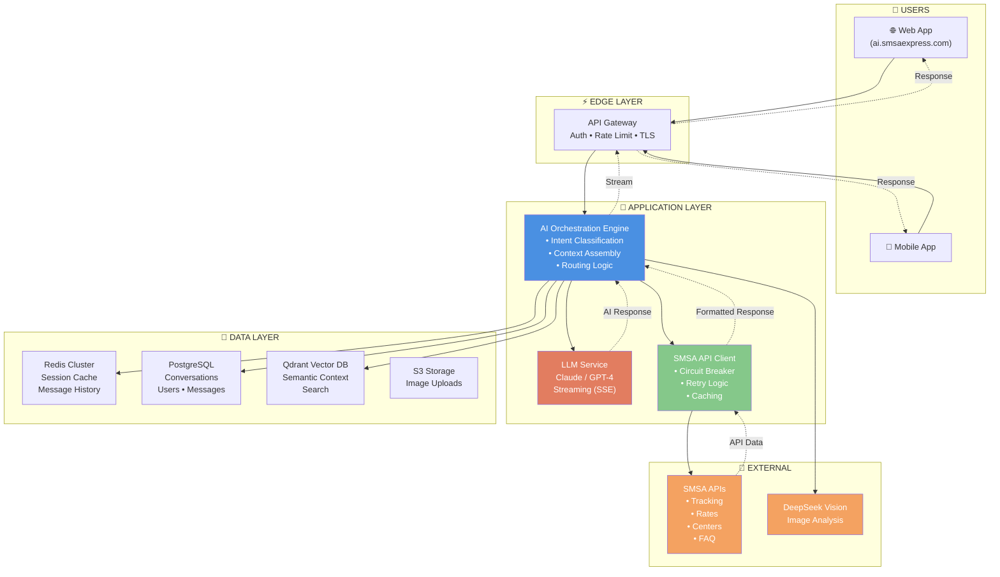

# SMSA AI Assistant – System Architecture

```mermaid
graph TB
    subgraph Users["👥 USERS"]
        Web["🌐 Web App<br/>(ai.smsaexpress.com)"]
        Mobile["📱 Mobile App"]
    end

    subgraph Edge["⚡ EDGE LAYER"]
        Gateway["API Gateway<br/>Auth • Rate Limit • TLS"]
    end

    subgraph App["🧠 APPLICATION LAYER"]
        Orchestration["AI Orchestration Engine<br/>• Intent Classification<br/>• Context Assembly<br/>• Routing Logic"]
        LLM["LLM Service<br/>Claude / GPT-4<br/>Streaming (SSE)"]
        APIClient["SMSA API Client<br/>• Circuit Breaker<br/>• Retry Logic<br/>• Caching"]
    end

    subgraph Data["💾 DATA LAYER"]
        Redis["Redis Cluster<br/>Session Cache<br/>Message History"]
        Postgres["PostgreSQL<br/>Conversations<br/>Users • Messages"]
        Qdrant["Qdrant Vector DB<br/>Semantic Context<br/>Search"]
        S3["S3 Storage<br/>Image Uploads"]
    end

    subgraph External["🔌 EXTERNAL"]
        SMSA["SMSA APIs<br/>• Tracking<br/>• Rates<br/>• Centers<br/>• FAQ"]
        Vision["DeepSeek Vision<br/>Image Analysis"]
    end

    Web --> Gateway
    Mobile --> Gateway
    Gateway --> Orchestration
    
    Orchestration --> Redis
    Orchestration --> Postgres
    Orchestration --> Qdrant
    Orchestration --> LLM
    Orchestration --> APIClient
    
    APIClient --> SMSA
    Orchestration --> Vision
    
    LLM -.->|AI Response| Orchestration
    SMSA -.->|API Data| APIClient
    APIClient -.->|Formatted Response| Orchestration
    Orchestration -.->|Stream| Gateway
    Gateway -.->|Response| Web
    Gateway -.->|Response| Mobile

    style Orchestration fill:#4A90E2,color:#fff
    style LLM fill:#E27D60,color:#fff
    style APIClient fill:#85C88A,color:#fff
    style SMSA fill:#F4A261,color:#fff
    style Vision fill:#F4A261,color:#fff
```
