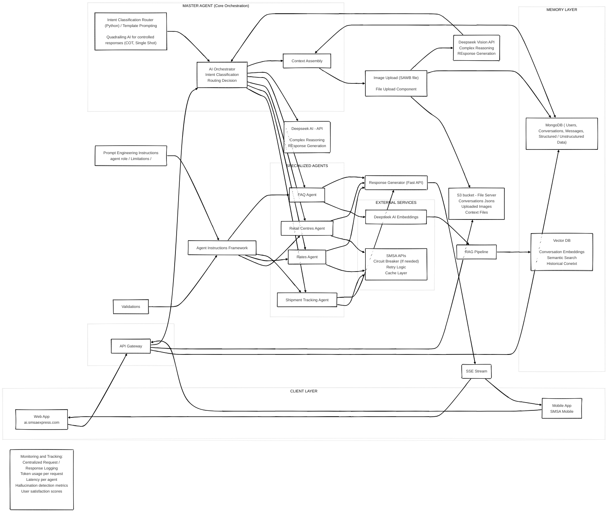

# SMSA Express AI Assistant - System Architecture

## Abstract

This document outlines the architecture for the SMSA Express AI Assistant, an intelligent customer service platform designed to handle shipment tracking, rate inquiries, retail centre information, and frequently asked questions. The system employs a multi-agent architecture with a central orchestration layer, specialized domain agents, and advanced memory management to deliver contextual, accurate, and real-time responses to customers across web and mobile platforms.

The architecture leverages Deepseek AI for natural language understanding and generation, implements a RAG (Retrieval-Augmented Generation) pipeline for knowledge retrieval, and integrates directly with SMSA's existing APIs for real-time data access. The system is designed for high availability, scalability, and observability with comprehensive monitoring and logging capabilities.

---

## Table of Contents

1. [System Overview](#1-system-overview)
2. [Client Layer](#2-client-layer)
3. [Technology Stack](#3-technology-stack)
4. [API Gateway](#4-api-gateway)
5. [Master Agent - Core Orchestration](#5-master-agent---core-orchestration)
6. [Specialized Agents](#6-specialized-agents)
7. [Memory Layer](#7-memory-layer)
8. [External Services Integration](#8-external-services-integration)
9. [File Handling & Vision Processing](#9-file-handling--vision-processing)
10. [Response Delivery](#10-response-delivery)
11. [Agent Instructions Framework](#11-agent-instructions-framework)
12. [Monitoring & Observability](#12-monitoring--observability)
13. [Data Flow](#13-data-flow)
14. [Security Considerations](#14-security-considerations)
15. [Scalability & Resilience](#15-scalability--resilience)

---

## 1. System Overview

### 1.1 High-Level Architecture

The SMSA Express AI Assistant follows a layered microservices architecture:

```
┌─────────────────────────────────────────────────────────────────────────────────┐
│                              CLIENT LAYER                                        │
│  ┌─────────────────────────────┐       ┌─────────────────────────────┐          │
│  │     🌐 Web Application      │       │     📱 Mobile Application   │          │
│  │    (ai.smsaexpress.com)     │       │       (SMSA Mobile)         │          │
│  │    Next.js + Tailwind       │       │       React Native          │          │
│  └──────────────┬──────────────┘       └──────────────┬──────────────┘          │
└─────────────────┼──────────────────────────────────────┼────────────────────────┘
                  │               HTTPS/SSE              │
                  └──────────────────┬───────────────────┘
                                     ▼
┌─────────────────────────────────────────────────────────────────────────────────┐
│                              API GATEWAY                                         │
│  ┌─────────────────────────────────────────────────────────────────────────┐    │
│  │                     Node.js + Express (Port 3000)                       │    │
│  │  ┌─────────────┐  ┌─────────────┐  ┌─────────────┐  ┌─────────────┐    │    │
│  │  │    Auth     │  │    Rate     │  │   Request   │  │     SSL     │    │    │
│  │  │   (JWT)     │  │  Limiting   │  │   Routing   │  │ Termination │    │    │
│  │  └─────────────┘  └─────────────┘  └─────────────┘  └─────────────┘    │    │
│  └─────────────────────────────────────────────────────────────────────────┘    │
└─────────────────────────────────────┬───────────────────────────────────────────┘
                                      │ HTTP POST
                                      ▼
┌─────────────────────────────────────────────────────────────────────────────────┐
│                         MASTER AGENT LAYER                                       │
│  ┌─────────────────────────────────────────────────────────────────────────┐    │
│  │                  Python + FastAPI + LangGraph (Port 8000)               │    │
│  │                                                                         │    │
│  │  ┌───────────────────┐    ┌───────────────────┐    ┌────────────────┐  │    │
│  │  │ Intent Classifier │───▶│  AI Orchestrator  │───▶│    Context     │  │    │
│  │  │     Router        │    │                   │    │    Assembly    │  │    │
│  │  └───────────────────┘    └─────────┬─────────┘    └────────────────┘  │    │
│  │                                     │                                   │    │
│  └─────────────────────────────────────┼───────────────────────────────────┘    │
└─────────────────────────────────────────┼───────────────────────────────────────┘
                                          │
                    ┌─────────────────────┼─────────────────────┐
                    ▼                     ▼                     ▼
┌─────────────────────────────────────────────────────────────────────────────────┐
│                          SPECIALIZED AGENTS                                      │
│                                                                                  │
│  ┌─────────────┐  ┌─────────────┐  ┌─────────────┐  ┌─────────────┐            │
│  │  Tracking   │  │    Rates    │  │   Retail    │  │     FAQ     │            │
│  │    Agent    │  │    Agent    │  │   Centres   │  │    Agent    │            │
│  │             │  │             │  │    Agent    │  │             │            │
│  │  📦 AWB     │  │  💰 Pricing │  │  📍 Locate  │  │  ❓ RAG     │            │
│  └──────┬──────┘  └──────┬──────┘  └──────┬──────┘  └──────┬──────┘            │
└─────────┼────────────────┼────────────────┼────────────────┼────────────────────┘
          │                │                │                │
          ▼                ▼                ▼                ▼
┌─────────────────────────────────────────────────────────────────────────────────┐
│                          EXTERNAL SERVICES                                       │
│                                                                                  │
│  ┌───────────────────────────────────┐    ┌───────────────────────────────────┐ │
│  │          SMSA APIs                │    │         Deepseek AI               │ │
│  │  ┌─────────┬─────────┬─────────┐  │    │  ┌─────────┬─────────┬─────────┐  │ │
│  │  │Tracking │  Rates  │Locations│  │    │  │   LLM   │Embedding│ Vision  │  │ │
│  │  │   API   │   API   │   API   │  │    │  │   API   │   API   │   API   │  │ │
│  │  └─────────┴─────────┴─────────┘  │    │  └─────────┴─────────┴─────────┘  │ │
│  └───────────────────────────────────┘    └───────────────────────────────────┘ │
└─────────────────────────────────────────────────────────────────────────────────┘

┌─────────────────────────────────────────────────────────────────────────────────┐
│                            DATA LAYER                                            │
│                                                                                  │
│  ┌─────────────────────┐  ┌─────────────────────┐  ┌─────────────────────┐      │
│  │      MongoDB        │  │    Vector DB        │  │     S3 Bucket       │      │
│  │                     │  │     (Qdrant)        │  │                     │      │
│  │  • Users            │  │                     │  │  • Conversations    │      │
│  │  • Conversations    │  │  • FAQ Embeddings   │  │  • Uploads          │      │
│  │  • Messages         │  │  • Doc Embeddings   │  │  • Processed Files  │      │
│  │  • Analytics        │  │                     │  │                     │      │
│  └─────────────────────┘  └─────────────────────┘  └─────────────────────┘      │
└─────────────────────────────────────────────────────────────────────────────────┘
```

### 1.2 Interactive Architecture Diagram

<details>
<summary><b>Click to expand Mermaid Diagram (Interactive View)</b></summary>



</details>

### 1.3 Design Principles

- **Separation of Concerns**: Each agent handles a specific domain, enabling independent development and scaling
- **Quadrailing AI**: Controlled response generation using Chain-of-Thought (COT) and Single Shot prompting strategies
- **Context-Aware**: Full conversation history and semantic context available for all interactions
- **Real-Time Integration**: Direct integration with SMSA APIs for live shipment and rate data
- **Observability-First**: Comprehensive logging, metrics, and monitoring throughout the system

---

## 2. Client Layer

### 2.1 Web Application

**URL**: `ai.smsaexpress.com`

The web application provides a browser-based interface for customers to interact with the AI assistant. 

**Features**:
- Real-time chat interface with SSE (Server-Sent Events) streaming
- File upload capability for SAWB (Shipping Air Waybill) documents
- Conversation history access
- Multi-language support (Arabic/English)

### 2.2 Mobile Application

**App Name**: SMSA Mobile

Native mobile application providing the same AI assistant capabilities optimized for mobile devices.

---

## 3. Technology Stack

### 3.1 Frontend Layer
| Component | Technology | Version | Purpose |
|-----------|-----------|---------|---------|
| Web App | Next.js | 14.x | Server-side rendering, SEO optimization |
| UI Framework | Tailwind CSS | 3.x | Responsive styling |
| Mobile App | React Native | 0.73.x | Cross-platform mobile interface |
| Real-time | EventSource API | Native | SSE streaming client |

### 3.2 API Gateway Layer
| Component | Technology | Version | Purpose |
|-----------|-----------|---------|---------|
| Runtime | Node.js | 20 LTS | JavaScript runtime |
| Framework | Express.js | 4.18.x | HTTP server framework |
| Authentication | - | 9.x | JWT/Bearer Token validation |
| Rate Limiting | express-rate-limit | 7.x | Request throttling |

### 3.3 Master Agent Layer
| Component | Technology | Version | Purpose |
|-----------|-----------|---------|---------|
| Agent Framework | LangGraph | 0.1.x | Stateful agent workflows |
| Runtime | Python | 3.12 | Agent execution environment |
| API Server | FastAPI | 0.109.x | HTTP endpoints for agents |
| LLM Integration | DeepSeek SDK/Vision | Latest | AI model access |
| Prompt Management | Custom Templates | - | Controlled AI responses |

### 3.4 Data Layer
| Component | Technology | Version | Purpose |
|-----------|-----------|---------|---------|
| Primary Database | MongoDB | 6.x | Conversations, users, messages |
| Vector Database | Qdrant | 1.7.x | Semantic search, embeddings |
| Object Storage | S3 Bucket | - | Images, conversation JSONs |

### 3.5 External Services
| Service | Provider | Purpose |
|---------|----------|---------|
| Vision AI | DeepSeek Vision | AWB extraction from images |
| Deepseek AI | version? | Complex reasoning, response generation |
| Embeddings | DeepSeek Embeddings | Text vectorization for RAG |
| SMSA APIs | Internal | Tracking, Rates, Centers, FAQ |

### 3.6 Request Flow Diagram

```
User Request
    ↓
Next.js Frontend (ai.smsaexpress.com)
    ↓ POST /api/chat
Node.js API Gateway (Port 3000)
    ↓ HTTP POST http://orchestrator:8000/api-name
Python Orchestrator (Port 8000)
    ↓ Does AI magic
Python sends response back via SSE
    ↓
Node.js streams to user
    ↓
User sees response
```

---

## 4. API Gateway

The API Gateway serves as the single entry point for all client requests, providing:

### 4.1 Core Functions

| Function | Description |
|----------|-------------|
| Authentication | JWT token validation, API key management |
| Rate Limiting | Request throttling per user/IP |
| Request Routing | Directing requests to appropriate services |
| Load Balancing | Distributing traffic across service instances |
| SSL Termination | HTTPS handling |

### 4.2 Integrations

The gateway directly connects to:
- **MongoDB**: Session management and user authentication
- **S3 Bucket**: File upload coordination
- **AI Orchestrator**: Primary request routing for AI interactions

---

## 5. Master Agent - Core Orchestration

The Master Agent is the brain of the system, responsible for understanding user intent and coordinating the appropriate response.

### 5.1 Intent Classification Router

**Technology**: Python-based classification engine

**Responsibilities**:
- Parse incoming user messages
- Classify intent using template prompting
- Route to appropriate specialized agent
- Handle multi-intent queries

**Intent Categories**:
```
├── TRACKING      → Shipment Tracking Agent
├── RATES         → Rates Agent
├── LOCATIONS     → Retail Centres Agent
├── FAQ           → FAQ Agent
└── AMBIGUOUS     → Clarification Flow
```

### 5.2 Quadrailing AI

The system implements controlled AI response generation through two primary strategies:

**Chain-of-Thought (COT)**:
- Used for multi-step queries
- Explicit reasoning steps before final answer
- Better accuracy for calculations and logical deductions

**Single Shot**:
- Used for straightforward queries
- Direct response generation
- Lower latency for simple requests

### 5.3 AI Orchestrator

Central coordination component managing:
- Agent selection and invocation
- Response aggregation from multiple agents
- Fallback handling when agents cannot respond
- Context injection for all agent calls

### 5.4 Context Assembly

**Responsibilities**:
- Retrieve relevant conversation history from MongoDB
- Coordinate file context from S3
- Build complete context object for agent processing

**Context Object Structure**:
```json
{
  "user": {
    "id": "string",
    "preferences": {},
    "history_summary": "string"
  },
  "conversation": {
    "id": "string",
    "messages": [],
    "current_intent": "string"
  },
  "files": {
    "uploaded": [],
    "extracted_data": {}
  },
  "semantic_context": {
    "relevant_documents": [],
    "similarity_scores": []
  }
}
```

---

## 6. Specialized Agents

Each specialized agent is designed to handle a specific domain of customer inquiries.

### 6.1 Shipment Tracking Agent

**Purpose**: Handle all shipment tracking inquiries

**Capabilities**:
- Track shipments by AWB number
- Provide delivery status and ETA
- Show shipment history and events

**Data Sources**:
- SMSA Tracking APIs
- Historical tracking data

**Example Intents**:
- "Where is my package?"
- "Track AWB 123456789"
- "When will my shipment arrive?"

### 6.2 Rates Agent

**Purpose**: Provide shipping rate quotations

**Capabilities**:
- Calculate shipping rates based on origin/destination/weight

**Data Sources**:
- SMSA Rates API
- Pricing rules engine

**Example Intents**:
- "How much to ship to Dubai?"
- "What's the rate for a 5kg package?"

### 6.3 Retail Centres Agent

**Purpose**: Provide information about SMSA retail locations

**Capabilities**:
- Find nearest retail centre
- Provide operating hours
- List available services per location

**Data Sources**:
- SMSA Location APIs
- Store information database

**Example Intents**:
- "Nearest SMSA branch to me"
- "What time does the Riyadh branch close?"
- "Which branches offer COD pickup?"

### 6.4 FAQ Agent

**Purpose**: Answer general questions using knowledge base

**Capabilities**:
- Answer policy questions
- Provide service information
- Handle how-to queries
- Escalate complex issues

**Data Sources**:
- Deepseek AI Embeddings
- RAG Pipeline
- Vector Database

**Example Intents**:
- "What's your return policy?"
- "How do I schedule a pickup?"
- "What items are prohibited?"

---

## 7. Memory Layer

### 7.1 Vector Database

**Purpose**: Semantic search and retrieval for FAQ/knowledge understanding

**Contents**:
| Data Type | Description |
|-----------|-------------|
| Embeddings | Vector representations of text |
| FAQ Embeddings | Knowledge base articles as vectors |
| Document Embeddings | Uploaded document content |

**Capabilities**:
- Similarity search for relevant context
- Knowledge base querying

**Integration**: Connected to RAG Pipeline for FAQ Agent

### 7.2 MongoDB

**Purpose**: Primary data store for structured and unstructured data

**Collections**:

```
├── users
│   ├── user_id
│   ├── profile
│   ├── preferences
│   └── auth_tokens
│
├── conversations
│   ├── conversation_id
│   ├── user_id
│   ├── created_at
│   ├── status
│   └── metadata
│
├── messages
│   ├── message_id
│   ├── conversation_id
│   ├── role (user/assistant)
│   ├── content
│   ├── timestamp
│   ├── intent
│   └── agent_used
│
└── analytics
    ├── session_data
    ├── agent_performance
    └── user_feedback
```

---

## 8. External Services Integration

### 8.1 SMSA APIs

**Integration Pattern**: RESTful API with resilience patterns

**API Endpoints**:
- Tracking API: `/v1/tracking/{awb}`
- Rates API: `/v1/rates/calculate`
- Locations API: `/v1/retail-centres`

### 8.2 Deepseek AI Integration

**Services Used**:

| Service | Purpose |
|---------|---------|
| Deepseek AI API | intent classification and response generation |
| Deepseek Embeddings | Text vectorization for RAG pipeline |
| Deepseek Vision API | Image understanding for document processing-AWB extraction| Max file size MB?/file-Type?

**API Configuration**:
- Temperature: 0.0 
- Max tokens: 500
- Streaming: Enabled for real-time responses

---

## 9. File Handling & Vision Processing

### 9.1 File Upload Component

**Supported Files**:
- SAWB documents (PDF, Image)

**Processing Flow**:
```
Image Upload → S3 Storage → Vision API → Extracted Data → Orchestrator
```
**Upload Flow**:
1. Client requests presigned URL from API Gateway
2. Direct upload to S3 bucket
3. Metadata stored in MongoDB
4. Processing triggered for AI analysis

### 9.2 S3 Bucket Storage

**Bucket Structure**:
```
smsa-ai-storage/
├── conversations/
│   └── {conversation_id}/
│       └── context.json
├── uploads/
│   └── {user_id}/
│       └── {file_id}.{ext}
└── processed/
    └── {file_id}/
        └── extracted_data.json
```
---

## 10. Response Delivery

### 10.1 Response Generator (FastAPI)

**Purpose**: Format and prepare responses from all agents

**Functions**:
- Response formatting and templating
- Multi-language translation
- Markdown/rich text processing
- Response validation

### 10.2 SSE Stream

**Technology**: Server-Sent Events

**Benefits**:
- Real-time token streaming
- Progressive response display
- Connection efficiency

**Implementation**:
```
Agent Response → Response Generator → SSE Stream → Client
```

---

## 11. Agent Instructions Framework

### 11.1 Prompt/Context Engineering Instructions

Each agent receives carefully crafted instructions defining:

| Component | Description |
|-----------|-------------|
| Agent Role | Clear definition of agent's purpose and scope |
| Limitations | Boundaries of what the agent can/cannot do |
| Response Format | Expected output structure |
| Tone & Style | Communication guidelines |
| Error Handling | How to handle edge cases |

### 11.2 Validations

Pre-processing validations applied to all agent interactions:

- Input sanitization
- Intent validation
- Parameter extraction and verification
- Rate limit verification

### 11.3 Framework Structure

```
Agent Instructions Framework
├── System Prompts
│   ├── tracking_agent_prompt.txt
│   ├── rates_agent_prompt.txt
│   ├── retail_agent_prompt.txt
│   └── faq_agent_prompt.txt
├── Validation Rules
│   ├── input_validators.py
│   └── output_validators.py
└── Response Templates
    ├── tracking_responses.json
    └── error_responses.json
```

---

## 12. Monitoring & Observability - WORK IN PROGRESS/WE WILL KEEP IT SIMPLE FOR PHASE 1   

### 12.1 Centralized Logging

All requests and responses are logged with:
- Unique request ID
- Timestamp
- User ID
- Intent classification
- Agent used
- Response time

### 12.2 Metrics Dashboard

| Metric | Description | Target |
|--------|-------------|--------|
| Token Usage per Request | Monitor AI cost and efficiency | < 1000 tokens avg? |
| Latency per Agent | Response time by agent type | < 2s p95 |
| Hallucination Detection | Accuracy and factual correctness | < 1% hallucination rate? |

---

## 13. Data Flow

### 13.1 Standard Query Flow

```
1. User sends message via Web/Mobile App
2. API Gateway authenticates and routes request
3. Request logged
4. Intent Classification Router analyzes message
5. context assembled from MongoDB
6. AI Orchestrator selects appropriate agent(s)
7. Agent processes request with SMSA API data
8. Response Generator formats output
9. SSE Stream delivers response to client
10. Conversation stored in MongoDB
11. Metrics logged for monitoring
```

### 13.2 Document Processing Flow

```
1. User uploads SAWB document
2. File stored in S3 bucket
3. Metadata recorded in MongoDB
4. Deepseek Vision API extracts content
5. Extracted data sent to Orchestrator
6. Context enriched with document data
7. Relevant agent processes enriched request
8. Response delivered via SSE Stream
```

### 13.3 RAG Query Flow

```
1. FAQ intent detected
2. User query embedded via Deepseek Embeddings
3. Vector DB searched for similar content
4. Top-k relevant infomation retrieved
5. Context assembled with retrieved information
6. FAQ Agent generates informed response
7. Response validated and delivered
```

---

## 14. Security Considerations

### 14.1 Authentication & Authorization

- JWT-based authentication

### 14.2 Data Protection

- Encryption at rest for all databases

### 14.3 API Security

- Rate limiting per user and IP
- Input validation and sanitization
- SQL injection prevention

---

## 15. Scalability & Resilience - NOT IN CURRENT SCOPE

### 15.1 Horizontal Scaling

| Component | Scaling Strategy |
|-----------|------------------|
| API Gateway | Load balancer with auto-scaling |
| Agent Services | Kubernetes pods with HPA |
| MongoDB | Replica sets with sharding |
| Vector DB | Distributed cluster |

### 15.2 Fault Tolerance

- Circuit breakers for external API calls
- Retry logic with exponential backoff
- Graceful degradation when services unavailable
- Multi-region deployment for disaster recovery

### 15.3 Performance Optimization

- Response caching at multiple layers
- Connection pooling for databases
- Async processing for non-critical operations
- CDN for static assets

---

## Appendix A: Technology Stack Summary

| Layer | Technology |
|-------|------------|
| Frontend | Next.js, SSE |
| API Gateway | API Gateway |
| Backend | Python, FastAPI |
| AI/ML | Deepseek AI (Chat, Embeddings, Vision) |
| Databases | MongoDB, Vector DB(Qdrant |
| Storage | AWS S3 |
| Container | Docker, Kubernetes |

---
